<picture>
  <source media="(prefers-color-scheme: dark)" srcset="assets/banner-dark.svg">
  
</picture>

  
  
  
  
  

  
  
  
  

I'm a financial engineering student at NYU Tandon (MS, May 2027, GPA 3.8) after three
years in market risk at Nomura, where I ran VaR and sensitivity models in production,
built the P&L and market-data reconciliation pipelines, and worked on Basel 2.5 / FRTB
submissions. The repos below are the research side: signals, pricing, execution, and
the C++ underneath.

**On the numbers.** Every figure on this page comes from a run I can repeat, and each
README names the command that produces it. In October 2026 I re-read every repo line by
line and re-ran it. That audit found a regime backtest whose labels were fitted on the
whole sample, an arbitrage scanner that treated partial baskets as complete, and a
handful of smaller errors. Each one is fixed, and the README says what changed and by
how much. Where a repo needs data, it now ships the data or a snapshot whenever the
licence allows, so it runs offline.

---

### 📈 Alpha research and backtesting

| Project | What it does | Stack |
|---|---|---|
| **[equity-xs-alpha](https://github.com/tejaspandya9598/equity-xs-alpha)** | Eight signals, two of them from SEC filing text, on 495 S&P 500 names → rank IC with Newey-West t-stats and Benjamini-Hochberg FDR → cost-aware quintile portfolios → LightGBM combination under purged walk-forward CV. Out-of-sample net Sharpe **0.79** against **−0.57** for equal weight; only Amihud illiquidity survives FDR. The filing-tone factor turned out to be a calendar artefact, and the README shows why | Python · LightGBM |
| **[macro-regime-allocation](https://github.com/tejaspandya9598/macro-regime-allocation)** | PCA and two-step K-Means on 120+ FRED-MD indicators drive mean-variance and a cost-aware convex allocator. The published regimes were fitted on 1959–2023, so every traded month was labelled with hindsight; refitting yearly drops the Ridge book to Sharpe **0.35**, below equal weight, while the multi-period convex book holds **0.50–0.70** net from 0 to 100 bps of cost | Python · cvxpy |
| **[stat-arb-backtester](https://github.com/tejaspandya9598/stat-arb-backtester)** | Event-driven pairs backtester on live Deribit crypto. Hedge ratios fitted in-sample only, costs on every flip, Benjamini-Hochberg across **10** pair tests. At the default 60% training window **no pair survives**, and the raw survivors change with the window | Python |
| **[prediction-markets](https://github.com/tejaspandya9598/prediction-markets)** | Polymarket neg-risk scanner for cross-outcome arbitrage, net of the quoted spread on every leg. Fixed a completeness bug that showed a 32-of-71-leg Nobel basket as a 32% riskless arbitrage. On the committed 2026-10-02 snapshot, **8 of 200** events stay positive after the spread, the largest at 1.7%. Snapshots replay exactly | Python |

### 🧮 Derivatives pricing and rates

| Project | What it does | Stack |
|---|---|---|
| **[sofr-swap-pnl-attribution](https://github.com/tejaspandya9598/sofr-swap-pnl-attribution)** | Discount curve bootstrapped from FRED Treasury par yields (SOFR swap rates are licensed), a $255M ten-swap 2–30y book, and daily P&L split into carry, roll-down, level, slope and curvature via key-rate durations. Par swaps reprice to **<1e-9**. Historical CVA on 20,000 bootstrapped paths prices wrong-way risk at **16.9% of CVA** | Python |
| **[sabr-vol-calibration](https://github.com/tejaspandya9598/sabr-vol-calibration)** | Hagan SABR calibrated to live Deribit BTC smiles: **0.43 vol-pt RMSE** across 21 strikes on the 18SEP26 expiry, 0.035 on synthetic ground truth with every parameter recovered. Bounds scale with the forward, so the same code fits rates and crypto | Python |
| **[options-pricing-engine](https://github.com/tejaspandya9598/options-pricing-engine)** | European, American and barrier options by Black-Scholes, Monte Carlo and Crank-Nicolson finite differences, cross-checked within ~0.6%; projected SOR for early exercise; put-call parity and in + out = vanilla tested in CI | C++20 |

### ⚡ Market microstructure and low latency

| Project | What it does | Stack |
|---|---|---|
| **[hft-matching-engine](https://github.com/tejaspandya9598/hft-matching-engine)** | Deterministic price-time-priority order book: O(1) cancels and executions, zero-allocation memory pool, 64-byte cache-aligned structures. **~21M msgs/sec on an Apple M2** over five million crossing limit orders, ~36M on Linux aarch64, ~10.7M through the lock-free pipeline | C++20 |
| **[optimal-execution](https://github.com/tejaspandya9598/optimal-execution)** | Almgren-Chriss liquidation and its efficient frontier, calibrated from live Deribit data. A 10%-of-ADV order costs **7.5 bps against TWAP's 4.7** for **38% less risk** (standard deviation of cost). A policy-gradient agent trained on 207k real five-minute bars converges to the closed form, and neither beats TWAP out of sample | Python |
| **[lob-market-manipulation-detection](https://github.com/tejaspandya9598/lob-market-manipulation-detection)** | Spoofing and layering detection over 1.4M Level-2 events with 27 cross-sectional and 13 temporal features, Isolation Forest and ECOD rank-averaged. The two agree at **0.865 Spearman** yet share only 76% of their top 5%. Unlabelled data, so no precision is claimed | Python · PyOD |

### 🔬 ML foundations and commodities

| Project | What it does | Stack |
|---|---|---|
| **[ml-algorithms-from-scratch](https://github.com/tejaspandya9598/ml-algorithms-from-scratch)** | GBDT, random forest, SVM (hinge sub-gradient and SciPy dual QP), logistic regression, trees, KNN, PCA, an MLP and an LSTM cell in NumPy. Matches scikit-learn's test accuracy to four decimals on logistic regression, linear SVM and the decision tree; the forest lands at 0.937 against 0.958 | NumPy |
| **[commodity_futures_settlement_price_analysis](https://github.com/tejaspandya9598/commodity_futures_settlement_price_analysis)** | WTI and Henry Hub settlement anomalies over 34 years of EIA data (1990–2024): **112 events, 79 corroborated** by an independent Isolation Forest, including the −$37.63 WTI print that a log transform had hidden. Streamlit term-structure dashboard | Python · Streamlit |

---

  
  
  
  
  
  
  
  
  

<i>Looking for full-time quant research, trading, development and risk roles from mid-2027.</i>

